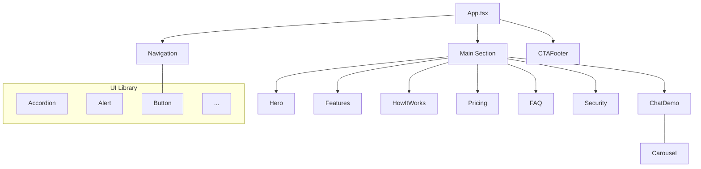

# Knowledge Context

## High-Level Architecture

```mermaid
flowchart LR
    A[User Browser] --> B[Vite + React SPA]
    B --> C[Components & Sections]
    B --> D[Tailwind CSS]
    B --> E[External APIs / Services]
    C --> F[ChatDemo, Hero, Features, Pricing, etc.]
    E -->|Optional| B
    subgraph Build
        B --> G[Vite build output (dist)]
        G --> H[Deployment (Vercel)]
    end
```

## Low-Level Component Hierarchy



*(UI Library represents dozens of `src/components/ui/*` primitives used by sections.)*
